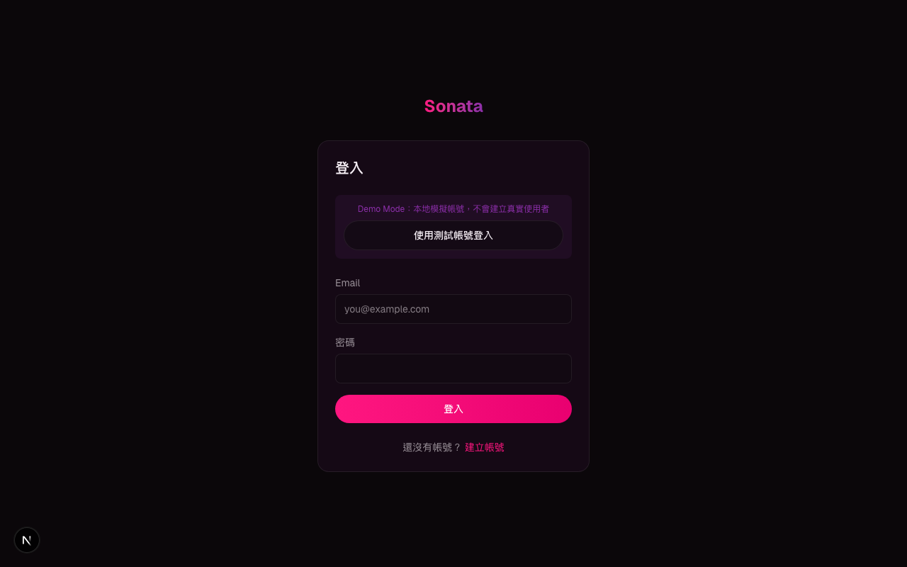
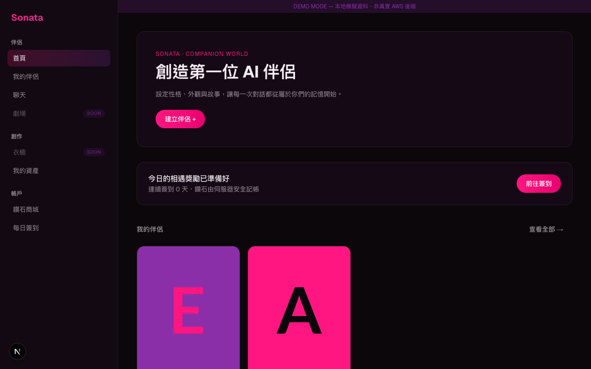
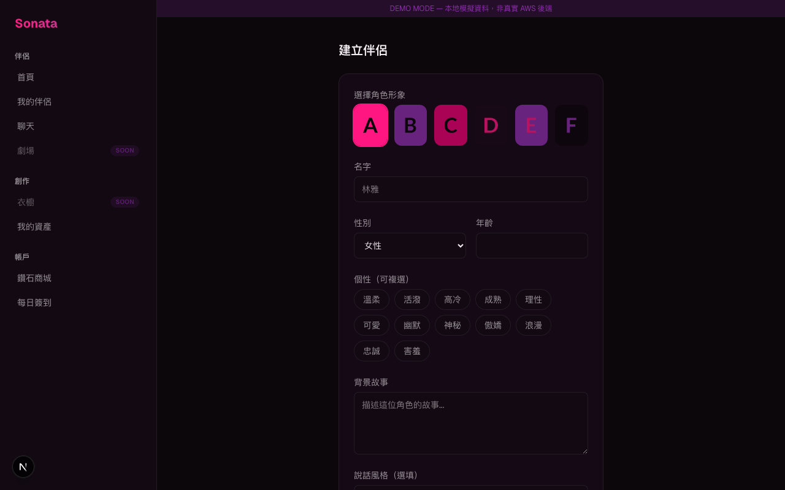
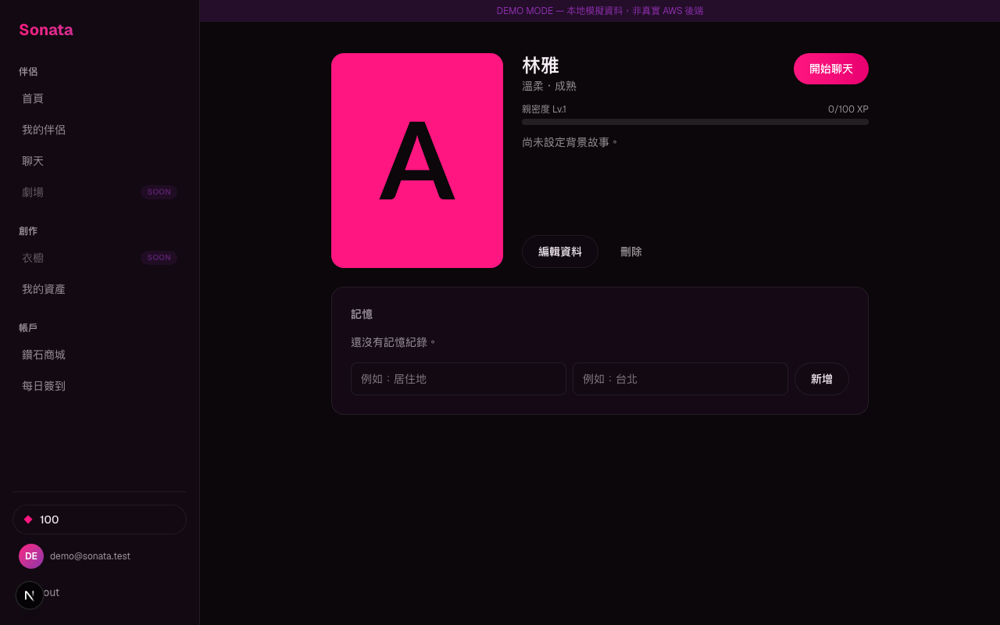
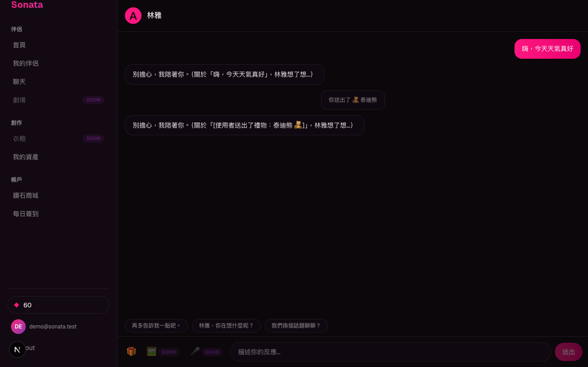
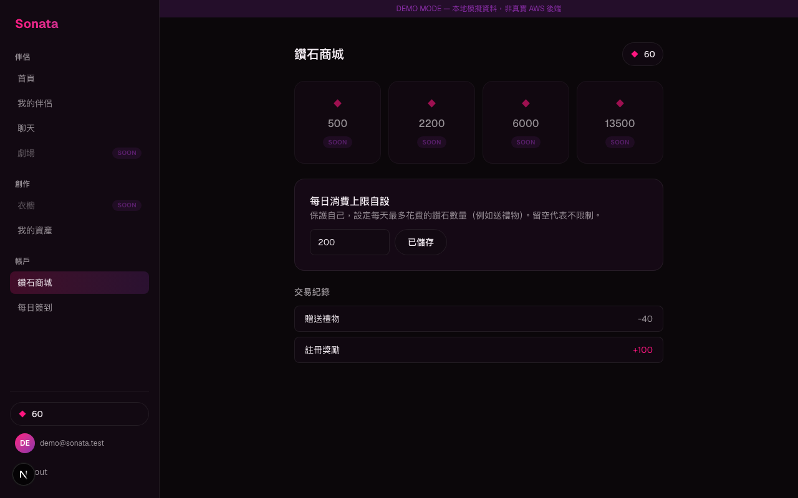
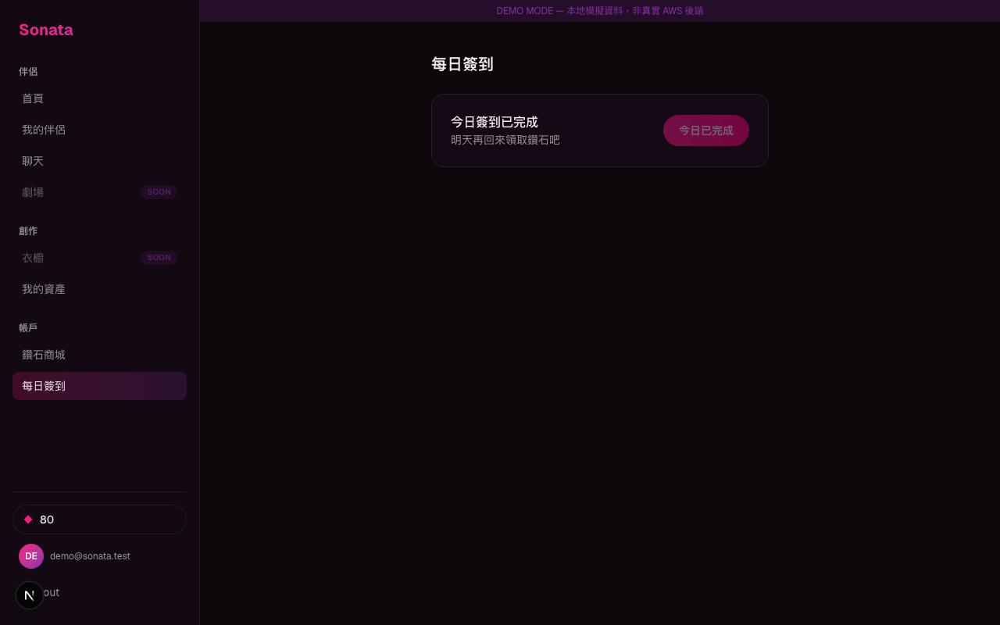
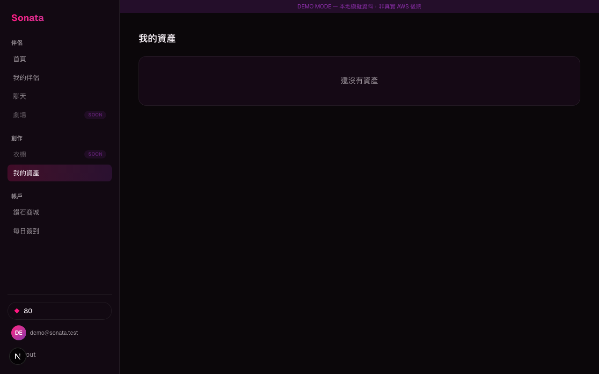

# Sonata — AI Companion Platform

An AI companion chat product (Character.AI/Replika-style): create a companion, chat with it, build a relationship, earn and spend a "Diamond" currency, and send gifts. Next.js + TypeScript + Tailwind on AWS Amplify Gen 2 (Cognito, Amplify Data/DynamoDB, Lambda, S3, EventBridge Scheduler).

## Screenshots

| | |
|---|---|
| **Login** | **Home** |
|  |  |
| **Create a companion** (preset avatars, 12 personality traits, speech style) | **Companion detail** (relationship level/XP, memory) |
|  |  |
| **Chat** (AI reply, gift narration + reaction) | **Diamond shop** (wallet, self-set spend limit, transaction history) |
|  |  |
| **Daily check-in** | **Assets gallery** |
|  |  |

*(Screenshots taken in [demo mode](#demo-mode-no-aws-needed) — the banner at the top of each page is only shown there.)*

## Features

- **Auth** — Cognito email/password, protected routes.
- **Companions** — create/edit/delete, preset avatar gallery, 12 personality traits, free-text speech style that feeds the AI's system prompt.
- **Chat** — AI replies behind a swappable `AIProvider` interface, suggested replies, typing indicator, retry-on-error, persists across reload.
- **Memory** — manual notes fed into the chat system prompt.
- **Relationship** — server-side XP per message, level progress bar.
- **Gifting** — 6-item catalog, atomic diamond spend, narration + AI reaction message, bigger XP bump than a normal message.
- **Wallet** — signup grant, daily check-in (+20), self-set daily spend limit, transaction ledger.
- **AI image generation backend** — full mock pipeline (QUEUED→PROCESSING→COMPLETED via a real async webhook, not a shortcut) kept in place for a future creator/admin pipeline; not exposed to end users (see [`MVP_IMPLEMENTATION_REPORT.md`](MVP_IMPLEMENTATION_REPORT.md) for why).

Full build notes, architecture decisions, and known limitations: [`MVP_IMPLEMENTATION_REPORT.md`](MVP_IMPLEMENTATION_REPORT.md).

## Getting started

```bash
npm install
npm run dev
```

### Demo mode (no AWS needed)

The app can run entirely without a deployed backend, using a localStorage-backed mock of Cognito + Amplify Data:

```bash
echo "NEXT_PUBLIC_DEMO_MODE=true" > .env.local
npm run dev
```

Open `/login` and click **"使用測試帳號登入"** (or type any email/password). See `lib/demo/config.ts` for exactly what this bypasses. Remove `.env.local` to go back to the real backend.

### Real AWS backend

```bash
npx ampx sandbox          # deploys Cognito/AppSync/Lambda/S3, writes amplify_outputs.json
npm run seed:pricing       # seeds the one GenerationPricing row
```

## Testing

```bash
npm run test:e2e
```

Playwright specs cover the full flow: auth, companion CRUD, chat + relationship XP, gifting + spend limit, daily check-in, and generation-webhook idempotency (the last one needs a real deployed backend and self-skips otherwise).

## Tech stack

Next.js 16 (App Router) · TypeScript · Tailwind v4 · AWS Amplify Gen 2 · Cognito · Amplify Data (DynamoDB) · Lambda · S3 · EventBridge Scheduler · Playwright
